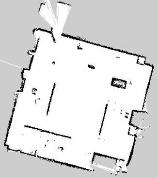
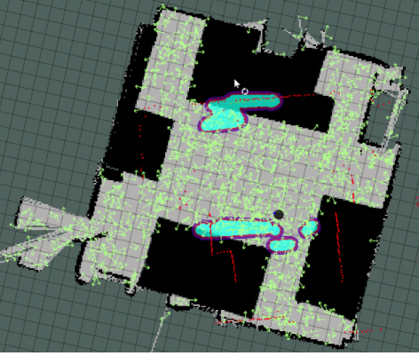
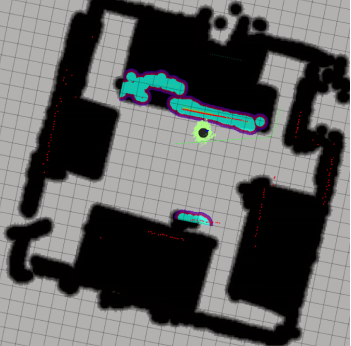

# Mobile Robot Navigation (Turtlebot2 )

Foobar is a Python library for dealing with word pluralization.


## Methodology
To achieve our goal  we will create static map  of the environments, localize the robot in the environment, make the robots perform path planning, visualize data of the 
different Navigation processes and debug errors using Rviz, configure the different Navigation nodes. Building the map is done by using the \textit{the SLAM gmapping package} which also provides different packages for saving the map to our local machine and also providing the map to other nodes. 

## Implementation

### Mapping 
In order to perform autonomous Navigation, the robot MUST have a map of
the environment. The robot will use this map for many things such as planning
trajectories, avoiding obstacles, etc. A prebuilt map of the environment can
be given to the robot or the robot can start by building the map first before
providing it to the other nodes. Simultaneous Localization and Mapping (SLAM). This is the name that defines the robotic problem of building a map of an unknown environment while simultaneously keeping track of the robot’s location on the map that is being
built. We need to use SLAM in order to create a Map of the Robot. The gmapping ROS package is an implementation of a specific SLAM algorithm called
gmapping. This package contains a node called slam gmapping which allows the creation of a 2D map using the laser and pose data that the robot is providing while moving around an environment. Basically the node reads data from the laser and the transforms of the robot, and turns it into an occupancy grid
map (OGM). Another of the packages available in the ROS Navigation Stack is the map server package. This package provides the map saver node, which
allows us to access the map data from a ROS Service, and save it into a file. The following command performs just that.
```bash
rosrun map_server map_server -f laser_map
```


This command will get the map data from the map topic, and write it out into
2 files, laser map.pgm and laser map.yaml. A PGM (Portable Gray Ma) file. A PGM is a file that represents a grayscale image. Whiter pixels represents free, blacker pixels are occupied and pixels in between are unknown. The map server package also provides the map server node this node reads a map from a file then provides it to other nodes like the move node for performing path planning or the amcl for localization. We can have access to the map by either calling the service static map or by listening to the /map latched topic. When a topic is latched, it means that the last message published to that topic will be saved. That means, any node that listens to this topic in the future will get this last message, even if nobody is publishing to this topic anymore.

#### Transforms
In order to be able to use the laser readings, we need to set a transform between the laser and the robot base, and add it to the transform tree. This basically tell
the Robot Where (Position and Orientation) the laser is mounted on the robot and it is refered to as transform between frames. A transform specifies how data expressed in a frame can be transformed into a different frame. This relationship between the position of the laser and the base of the robot is known in ROS as the TRANSFORM between the laser and the robot. The slam gmapping node needs two transforms.   

1.  /laser_frame  => /base_link
2. /base_link => /odom

#### Visualize Mapping in RVIZ
For Mapping, we basically need to use three displays of RViz:
1. LaserScan Display
2. Map Display
3. Robot Model
   
### Localization
When a robot moves around a map, it needs to know which is its POSITION
within the map, and which is its ORIENTATION this is known as the pose of
the robot. Determining the pose using the robots sensors is known as **Robot Localization**. In this section we will present the way we configured the turtlebot for a better localization. The AMCL (Adaptive Monte Carlo Localization) package provides the amcl node, which uses the MCL system in order to track the localization of a robot moving in a 2D space. the generates many random
guesses as to where it is going to move next. These guesses are known as particles. Each particle contains a full description of a possible future pose. When
the robot observes the environment it’s in (via sensor readings), it discards particles that don’t match with these readings, and generates more particles close
to those that look more probable. The amcl node reads the data published into the laser topic (/scan), the map topic(/map), and the transform topic (/tf), and published the estimated pose where the robot was in to the /amcl pose and the
*/particlecloud* topics.  
In the previous section we talked about how the map server node is used to
provide the map. So once it has been provided the amcl node makes use of that map. We achieved this by calling the map server node into the amcl launch file.
The code for that is as follows:

```xml
<arg name="map_file" default="$(find provide_map)maps/laser_map.yaml"/>
<node name="map_server" pkg="map_server" type="map_server" args="$(arg map_file)"/>
```

Configuration is also very important to properly localizing the robot in the
environment. In order to get a proper Robot localization, we fullfilled 3 basic
requirements:

1. Provide Good Laser Data
2. Provide Good Odometry Data
3. Provide Good Laser-map Data

As discussed previously transform plays an important role in navigation.
the amcl node transforms incoming laser scans to the odemetry frame. So there
must be a path through the transform tree from the frame in which the laser
scans are published to the odometry frame


The amcl node provides a service called global localization in order to restart
the positions of the particles, and is able to make use of a service called static map
in order to get the map data it needs. The textbfglobal localization service initiate globlocalization wherein all particles are dispersed randomly throughout
free space in the map. We will make use of this feature to predict the localization of the robot in one of our packages. To have a more acurate localization
we used RVIZ to estimate a pose of the robot then we used the
get pose topic to get the pose of the robot then hardcoded that pose so that.
Anytime the navigation process start the robot is well localized.

#### Visualize Localization
Localization can be visualized in RVIZ by adding the following displays:
1. LaserScan Display
2. Map Display
3. PoseArray Display



### Path Planning
In this section we will look at what it takes to move the robot from point
A to point B. As it custom to not reinvent the wheel we will use an exiting
package to implement this task. The package that allows this behavior is called
The Move base package, it is part of the Ros navigation stack just as all
the packages discuss thus far. The package has a node called move base which
main function is to move the robot from its current position to a goal position.
The node is an implementation of a SimpleActionServer. the action Server
provides the topic move base/goal which is the input of the navigation. stack.
This topic is then used to provide the goal pose. When this node receives a
goal pose, it links components such as the global planner, local planner,
recovery behavior and costmaps and generates an output which is a velocity
command and send it to the /cmd vel topic in order to move the robot.

#### The Global Planner
 goal received by the move base node is immediately sent to the global planner,
which is in charge of calculating a safe path in order to arrive at that goal pose.
This path is calculated before the robot starts moving, as such it will not take
into account the readings of the sensor of the robot as it moves, it then publishes
the found created path to the /plan topic.  


The planning of a trajectory by the global planner is done according to a
map called the The Global Costmap. A costmap is basically a map that
repreents places that are safe for the robot to be in a grid of cells. Usually
a costmap has binary valies, representing either the space or places where the
robot would be in collision. But to be more specific each cell in a costmap has an integer value in the range (0, 255). Amoung these values there are special
values frequently used in this range.

1. **255** reserved for cells where not enough information is known
2. **254** indicates that a collision causing obstacles was sensed in this cell
3. **253** indicates no obstacle, but moving the center of the robot to this location will result in a collision
4. **0**   cells where there are no obstacles and, therefore moving the center of the robot to this position will not result in a collision

The global planner uses the global costmap in order to calculate the path to
follow




The global costmap also has its own parameters, which are defined in a
YAML file in the directory *my_move_base_launcher/params/global_costmap_params.yaml*. The most important that we used are the following:
1. **global_frame**: the global frame for the costmap to operate in.
2. **static_map**: Whether or not to use a rolling window version of the costmap. if the static map is set to true, this parameter must be set to false.


To visualize the **global path planning** using RVIZ use the path display and listening
to the topic */path*. Also we can visualize the **global costmap** using the Map display and
listening to global costamp topic.


#### The Local Planner
Once the previously discussed global planner has calculated the path to follow
this path is sent to the local planner. The local planner, then will execute each
segment of the global plan (let’s imagine the local plan as a smaller part of
the global plan). So given a plan to follow and a map, the local planner will
provide velocity commands in order to move the robot. the local planner can
recompute the robot’s path on the fly in order to keep the robot from striking
objects, yet still allowing it to reach its destination. Different types of local
planners also exist to choose from depending on the setup (The robot of use,
the environment) and the type of performance wanted. This project makes
use of the base local planner. It provides implementation of the trajectory
rollout and Dynamic Window Approach (DWA) algorithms in order to calculate
and execute a plan. Let summarize the basic idea of how this algorithms works:
1. Discretely sample from the robots control space
2. For each sampled velocity, perform forward simulations from the robot’s current state to predict what would happen if the sampled velocity was applied.
3. Evaluate each trajectory resulting from the forward simulation.
4. Discard illegal trajectories.
5. Pick the highest-scoring trajector and send the associated velocity to the mobile base.
6. Rinse and Repeat

The local planner also has its own parameters. These parameters will be different depending on the local planner you use. These parameters are set in
a YAML file they include Robot Configuration Parameter, Goal Tolerance parameters, Forward simulation parameters The list of all these
parameters can be found on the move base documentation site. We previously spoke about the global costmap as being used by the global planner in the same way, the local planner also makes use of a costmap called the local costmap, in order to calculate local plans. It is important to Note that the obstacle layer uses different plugins for the local costmap and the global costmap. For the local costmap, it uses the costmap 2d::ObstacleLayer, and for the global costmap it uses the costmap 2d::VoxelLayer. The obstacle layer is in charge of the marking and clearing operations. There is one last parameter files related to both the global and local costmaps that we ded not discuss, that
is the common costmap parameter file. It configuration is used for both the previously mentioned costmaps.

#### Recovery Behaviors

It could happen that while trying to perform a trajectory, the robot gets stuck for some reason. Fortunately, if this happens, the ROS Navigation Stack provides
methods that can help your robot to get unstuck and continue navigating. These are the recovery behaviors. We made use of the two recovery behaviors provided
by the Ros navigation stack. The Rotate Recovery behavior attempts to clear out space by rotating the robot 360 degrees. The other one is the Clear Costmap
recovery, this behavior simply clears out space by clearing obstacles outside of a specified region from the robot’s map. Basically, the local costmap reverts to
the same state as the global costmap.

#### Conclusion
In order to navigate around a map autonomously, a robot needs to be able to
localize itself into the map. And this is precisely the functionality that the
amcl node (of the amcl package) provides us. In order to achieve this, the amcl
node uses the MCL (Monte Carlo Localization) algorithm. The Robot can’t
navigate without a map. But, surely, the robot can’t navigate if it isn’t able
to localize itself in it either. So, the localization process is another key part
of ROS Navigation. Bascially, the amcl node takes data from the laser and
the odometry of the robot, and also from the map of the environment, and
outputs an estimated pose of the robot. The more the robot moves around the
environment, the more data the localization system will get, so the more precise
the estimated pose it returns will be.
## Installation

Use the package manager [pip](https://pip.pypa.io/en/stable/) to install foobar.

```bash
pip install foobar
```

## Usage

```python
import foobar

foobar.pluralize('word') # returns 'words'
foobar.pluralize('goose') # returns 'geese'
foobar.singularize('phenomena') # returns 'phenomenon'
```

## Contributing
Pull requests are welcome. For major changes, please open an issue first to discuss what you would like to change.

Please make sure to update tests as appropriate.

## License
[MIT](https://choosealicense.com/licenses/mit/)